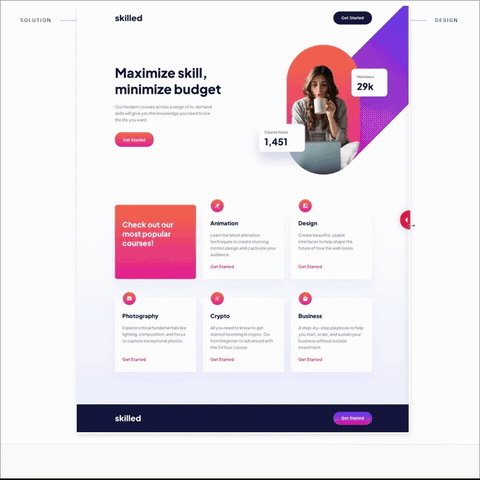

# Workit Landing Page 

Esta é uma solução para o desafio [Skilled e-learning landing page](https://www.frontendmentor.io/challenges/skilled-elearning-landing-page-S1ObDrZ8q) do site [Frontend Mentor](https://www.frontendmentor.io).

---

## Índice
- [Workit Landing Page](#workit-landing-page)
  - [Índice](#índice)
  - [Descrição](#descrição)
    - [Desafio](#desafio)
    - [Captura de tela](#captura-de-tela)
    - [Link](#link)
  - [Processo](#processo)
    - [Contrução](#contrução)
    - [Recursos úteis](#recursos-úteis)
  - [Autor](#autor)

---

## Descrição

### Desafio

Os usuarios devem ser capazes de:

- Ver o layout ideal para a interface, independente do tamanho da tela do seu dispositivo.
- Ver os estados de foco de todos os elementos interativos da página.

### Captura de tela

 

### Link
- [Site](https://02-skilled-elearning-landing-page.vercel.app)
- [Solução](https://www.frontendmentor.io/solutions/skilled-elearning-landing-page-YojlZWJh4b)

## Processo

### Contrução

- Mobile First
- HTML Semântico
- SCSS
- Flexbox
- Grid
- Mixin
- Media Queries

### Recursos úteis

- [Sass](https://www.w3schools.com/sass/sass_intro.php)
- [Váriaveis](https://www.w3schools.com/sass/sass_variables.php)
- [Mixin](https://www.w3schools.com/sass/sass_mixin_include.php)
- [Flexbox](https://www.w3schools.com/css/css3_flexbox.asp)
- [Grid](https://www.w3schools.com/css/css_rwd_grid.asp)
- [Media Queries](https://www.w3schools.com/css/css3_mediaqueries.asp)

---

## Autor

---